# 立健骨科診所 - 響應式前端練習專案

本專案是一個以「**純 HTML / CSS**」手刻完成的靜態網站，模擬虛構的「立健骨科診所」。  
開發目的為練習 **RWD 響應式網頁設計**，不使用任何前端框架（例如 Bootstrap），  
並確保在桌面、平板與手機上皆具備良好的閱讀與操作體驗。

---

### 專案特色 (Features)

這個專案的核心在於響應式設計的實作，涵蓋了多種現代 RWD 的解決方案：

* **響應式導覽列 (Responsive Navigation)**
    * 在桌面版上為標準的橫向導覽列。
    * 在手機版上會自動收合為**漢堡選單**，選單展開後會以側滑方式呈現。
    * 此功能使用**純 CSS** 實現，不依賴任何 JavaScript，技巧性地利用了 `<input type="checkbox">` 搭配 `:checked` 偽類選擇器來控制選單的開關狀態。

* **彈性佈局 (Flexible Layout)**
    * 大量使用 **Flexbox** 與 **CSS Grid** 進行頁面佈局，確保內容區塊能根據螢幕寬度自動調整排列方式。
    * 實作了典型的 RWD 佈局轉換：
        * **側邊欄 (Sidebar)**：在桌面版上與主內容並排，在手機版上會自動隱藏，其內容被整合至漢堡選單中，以節省手機螢幕空間。
        * **醫師介紹**：在桌面版上為「照片欄 vs. 文字欄」的兩欄式佈局，在手機版上則智慧地轉換為「一位醫師的照片+介紹」為一組的單欄垂直堆疊，符合行動裝置的閱讀習慣。

* **響應式表格 (Responsive Tables)**
    * 針對不同類型的表格，應用了兩種不同的 RWD 解決方案：
        1.  **卡片式佈局 (Card-style)**：將「衛教專區」的傳統表格，在手機上轉換為一張張獨立的資訊卡片，大幅提升了在小螢幕上的可讀性。
        2.  **水平捲動 (Horizontal Scroll)**：將「門診時刻表」這種多欄位的寬表格，在手機上改為可左右滑動的模式，確保所有資訊都能被看到且不破壞版面。

* **內容搬移與顯示切換**
    * 實作了在不同裝置上，將同一區塊內容（例如聯絡資訊）顯示在不同位置的技巧。透過複製 HTML 結構並搭配 CSS 的 `display` 屬性，達成桌面版顯示在側邊欄底部，手機版顯示在頁面最下方的效果。

---

### 使用技術 (Technologies Used)

* **HTML5**：使用語意化標籤建立網頁結構。
* **CSS3**：
    * **Flexbox**：用於主體佈局、Header、Footer 等。
    * **CSS Grid**：用於醫師介紹的複雜二維佈局。
    * **Media Queries**：實現響應式設計的核心。
    * **偽元素 (`::before`, `::after`)** 與 **偽類 (`:checked`)**：用於繪製漢堡圖示與實現純 CSS 互動效果。
* **無 JavaScript 依賴**：本專案的核心 RWD 功能皆為純 CSS 實現。

---

### 專案結構 (File Structure)

```
/
├── index.html              # 首頁
├── README.md               # 專案說明檔
├── assets/
│   ├── css/
│   │   └── style.css       # 主要樣式檔
│   └── images/
│       └── (所有圖片資源)
└── pages/
    ├── about.html          # 關於我們 (門診時刻表)
    ├── doctor.html         # 主治項目 (醫師介紹)
    ├── nurse.html          # 衛教專區 (表格)
    └── ...                 # 其他頁面
```

---

### 開發心得與挑戰

在這次的專案中，最大的挑戰是如何在不動到原始設計理念的前提下，將一個為桌面設計的版面，優雅地轉換為適合手機的 RWD 佈局。

* **表格 RWD**：花費最多心力研究的部分。從最初的水平捲動，到為了追求更好的使用者體驗而改用卡片式佈局，讓我深刻體會到 RWD 並非只有一種答案，而是需要根據內容選擇最佳的呈現方式。
* **純 CSS 互動**：透過實作漢堡選單，加深了對 Checkbox Hack 技巧與 CSS 權重的理解。
* **佈局重排**：醫師介紹頁面的佈局轉換，讓我對 CSS Grid 的強大功能有了更深的認識，它能夠在不改變 HTML 順序的情況下，自由地重新排列元素，是 RWD 的一大福音。

這個專案讓我從頭到尾完整地走過了 RWD 的思考與實作流程，是一個非常有價值的練習。

### 網頁截圖

> 本站所有 RWD 與導覽互動皆以 **純 CSS** 完成（無 JS）。

首頁
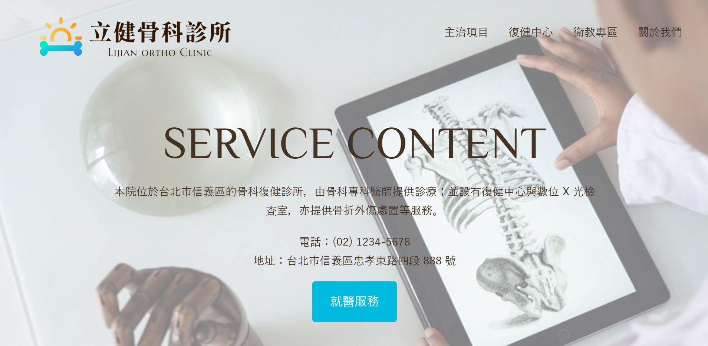

醫師介紹
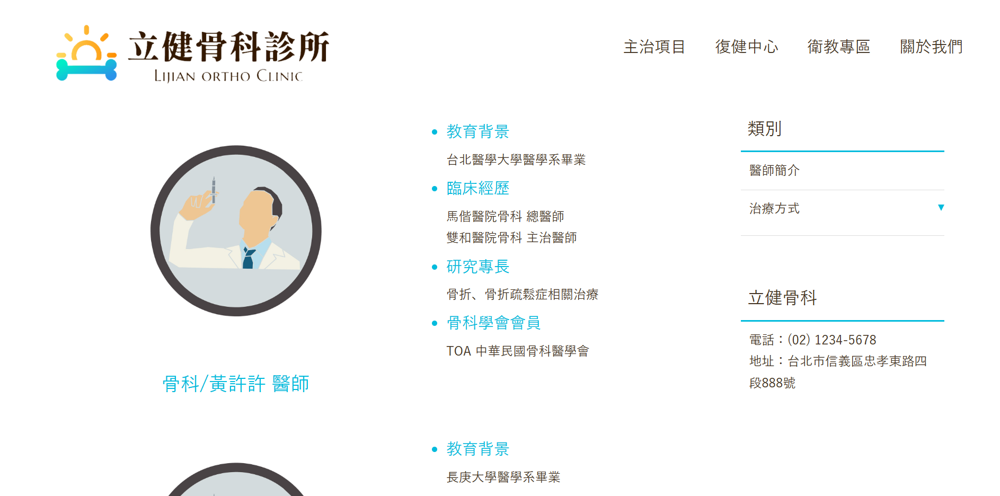

衛教網站
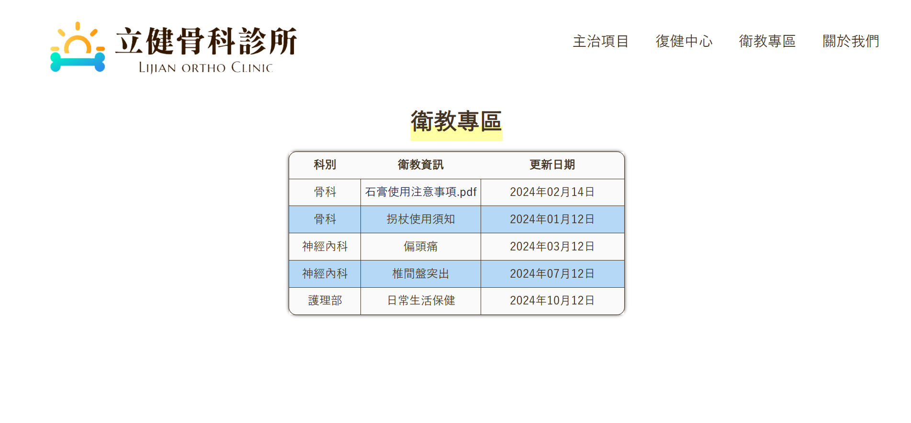

治療介紹
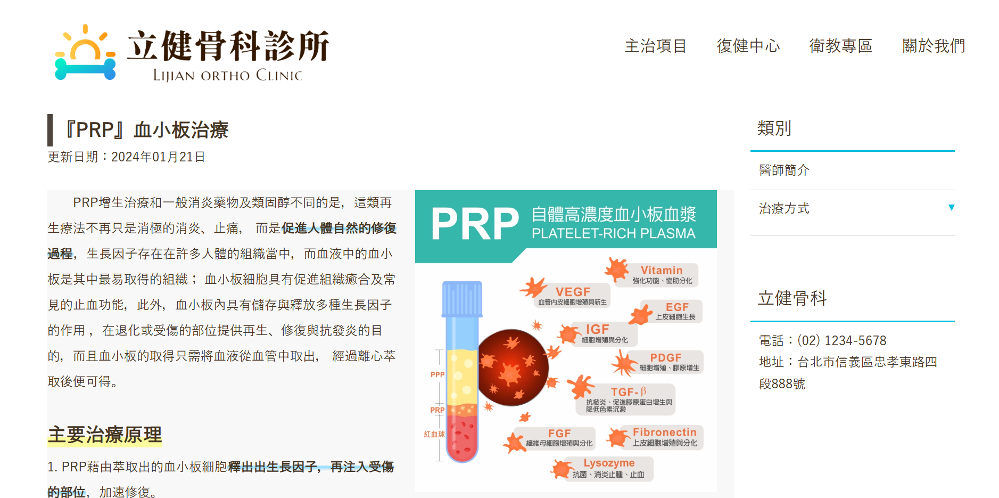

物理治療
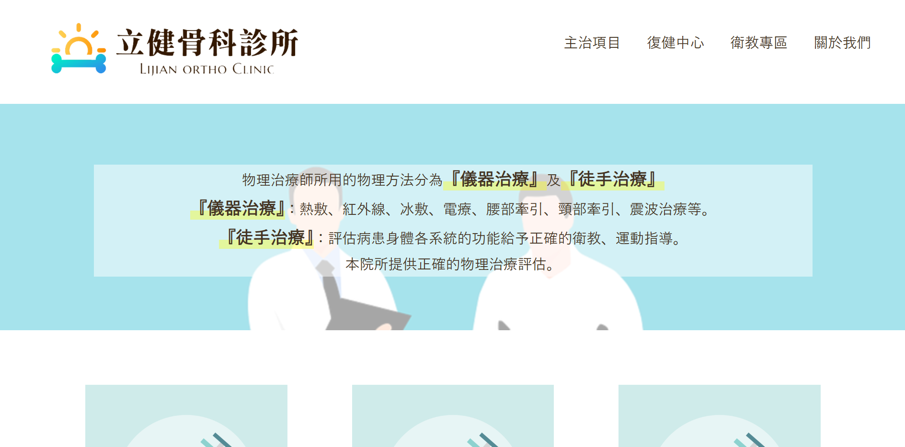

門診時刻
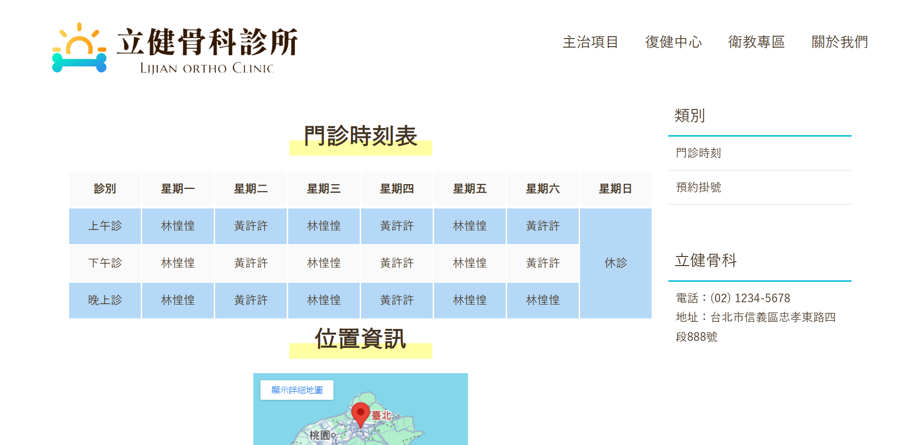

預約畫面
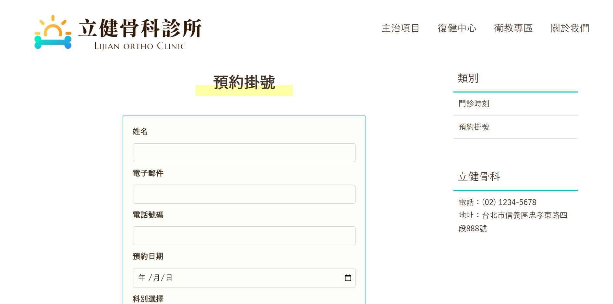

手機畫面（Mobile View）
<table>
  <tr>
    <td>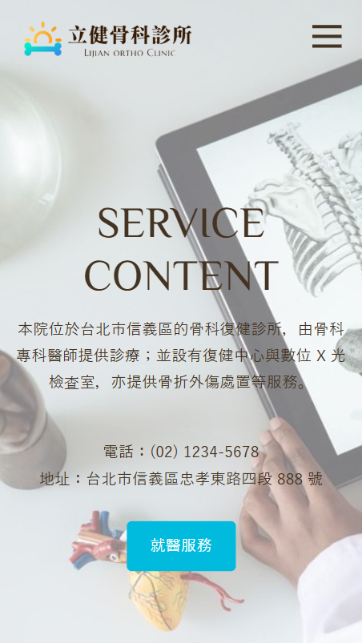</td>
    <td>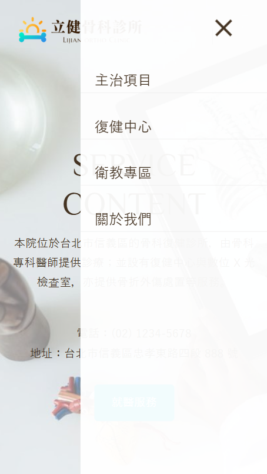</td>
    <td>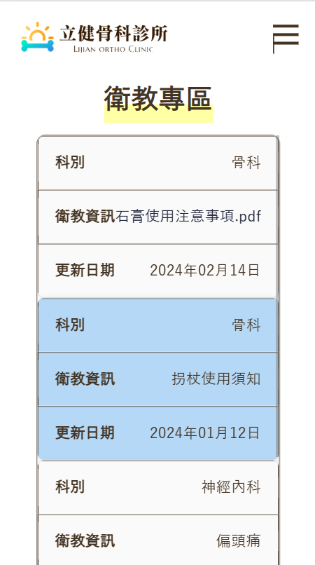</td>
    <td>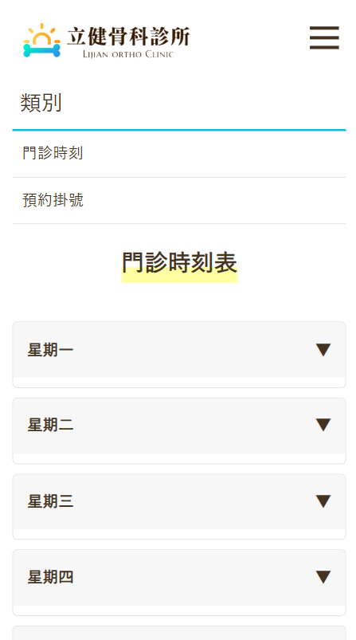</td>
  </tr>
</table>

### 作者

Blair Lin (林姿佑)  
資訊管理系學生｜醫療科技專案研究助理  
Email: tzuyuu1015@gmail.com